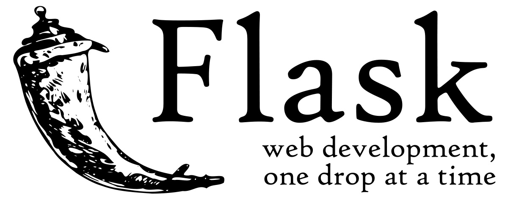

# Flask Blog

Hello there, this is my hello world flask application, a blog app.

    

# Deployment

To test and use my this blog : http://tahaahmed.pythonanywhere.com/

# Demo

https://user-images.githubusercontent.com/92264237/208316834-2a773ca0-913c-4fda-af88-8dec4ee2dee4.mp4

# Features

* Register a new account
* Login to your account
* Account info can be updated
* Request an email to reset passoword if forgotten
* Create, read, update, and delete post
* Home page with all posts orders by date posted
* User posts page with all his posts

more features will ba added gradually

# Acknowledgement

Special thanks for [Corey Schafer](https://www.youtube.com/channel/UCCezIgC97PvUuR4_gbFUs5g) for creating one of the best tutorials for flask development 
https://www.youtube.com/playlist?list=PL-osiE80TeTs4UjLw5MM6OjgkjFeUxCYH
